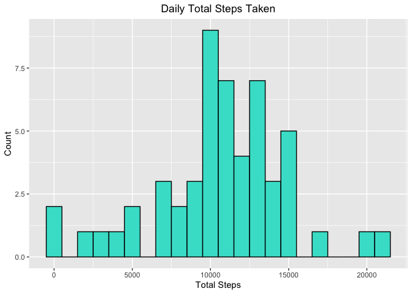
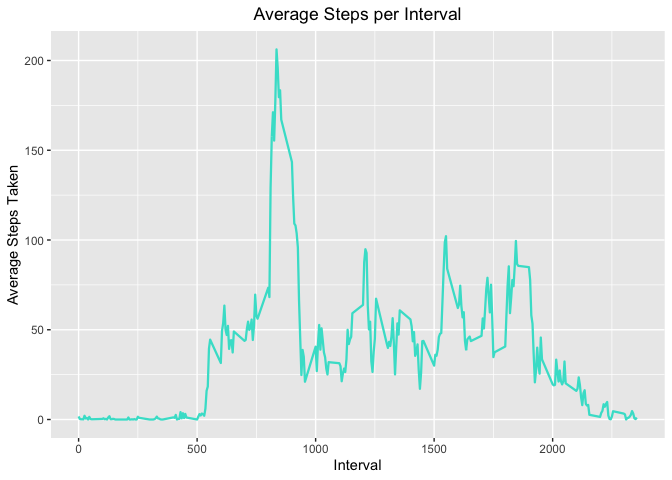
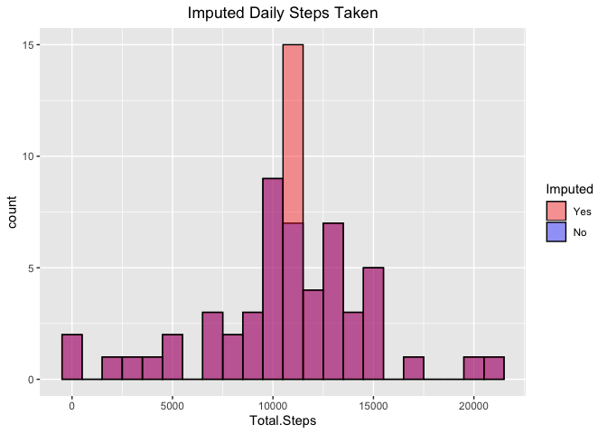
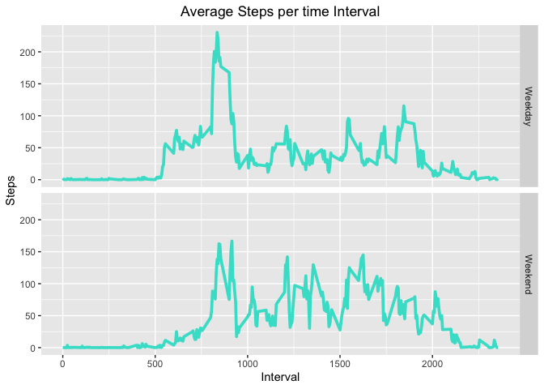

It is now possible to collect a large amount of data about personal movement using activity monitoring devices such as a Fitbit, Nike Fuelband, or Jawbone Up. These type of devices are part of the "quantified self" movement - a group of enthusiasts who take measurements about themselves regularly to improve their health, to find patterns in their behavior, or because they are tech geeks. But these data remain under-utilized both because the raw data are hard to obtain and there is a lack of statistical methods and software for processing and interpreting the data.

This assignment makes use of data from a personal activity monitoring device. This device collects data at 5 minute intervals through out the day. The data consists of two months of data from an anonymous individual collected during the months of October and November, 2012 and include the number of steps taken in 5 minute intervals each day.

The data used in this report can be found [here](https://d396qusza40orc.cloudfront.net/repdata%2Fdata%2Factivity.zip)

### Loading and Processing the Data

```r
# Load Required Libraries
library(ggplot2)
library(dplyr)

# Download file containing zipped data
if (!file.exists("Data")) {
        file <- "https://d396qusza40orc.cloudfront.net/repdata%2Fdata%2Factivity.zip"
        download.file(file, "./Data")
        unzip("./Data")
}

# Read Data and format
Data <- read.csv("./activity.csv")
Data$date <- as.Date(Data$date)
Data$interval <- as.factor(Data$interval)
Data <- tbl_df(Data)
```
To get a quick view of the Data:

```r
str(Data)
```

```
## Classes 'tbl_df', 'tbl' and 'data.frame':	17568 obs. of  3 variables:
##  $ steps   : int  NA NA NA NA NA NA NA NA NA NA ...
##  $ date    : Date, format: "2012-10-01" "2012-10-01" ...
##  $ interval: Factor w/ 288 levels "0","5","10","15",..: 1 2 3 4 5 6 7 8 9 10 ...
```

There are three columns shown signifying the three variables listed as followed.

- **steps:** Number of steps taking in a 5-minute interval (missing values are coded as NA\color{red}{\verb|NA|}NA)
- **date:** The date on which the measurement was taken in YYYY-MM-DD format
- **interval:** Identifier for the 5-minute interval in which measurement was taken

### What is the mean total number of steps taken per day?

```r
# Calculate total steps taken per day over all intervals
Daily_steps <- tapply(Data$steps, Data$date, sum)
Daily_steps <- as.data.frame(Daily_steps)
colnames(Daily_steps) <- "Total.Steps"

# Create histogram for total steps taken each day
ggplot(Daily_steps, aes(x = Total.Steps)) + 
        geom_histogram(col = "black", fill = "turquoise", binwidth = 1000) + 
        ylab("Count") + xlab("Total Steps") + ggtitle("Daily Total Steps Taken") +
        theme(plot.title = element_text(hjust = 0.5))
```

<!-- -->

```r
# Display statistical summary with mean included
summary(Daily_steps, na.rm = T)
```

```
##   Total.Steps   
##  Min.   :   41  
##  1st Qu.: 8841  
##  Median :10765  
##  Mean   :10766  
##  3rd Qu.:13294  
##  Max.   :21194  
##  NA's   :8
```
Therefore, the average steps taken over a day is highest in the morning with a peak at the 8:35 - 8:40 time interval.


### What is the average daily activity pattern?

```r
# Calculate average steps per interval over all days
TS_steps <- tapply(Data$steps, Data$interval, mean, na.rm = T)
time_df <- as.data.frame(TS_steps)
colnames(time_df) <- "avg.steps"
time_df$interval <- rownames(time_df)
time_df$interval <- as.numeric(time_df$interval)

# create line plot for average steps per interval
ggplot(time_df, aes(x = interval, y = avg.steps, group = 1)) + geom_line(col = "turquoise", lwd = 0.8) +
        xlab("Interval") + ylab("Average Steps Taken") +
        ggtitle("Average Steps per Interval") + theme(plot.title = element_text(hjust = 0.5))
```

<!-- -->

```r
# Which interval has the highest average steps over all days
time_df %>% filter(avg.steps == max(time_df$avg.steps))
```

```
##   avg.steps interval
## 1  206.1698      835
```

### Imputing missing values

There are 2304 missing values in the data, accounting for 13.11% of the data. To deal with the missing values, I will replace all NA's in the step column with the mean for that interval over all days.


```r
# Filling in missing values with mean of Interval. 
Data2 <- Data %>% group_by(interval) %>%
        mutate(steps=ifelse(is.na(steps),mean(steps,na.rm=TRUE),steps))

# Combining imputed and non-imputed data frames for graphing 
Daily_steps$Imputed <- "No"
Data2 <- ungroup(Data2)
Daily_steps2 <- tapply(Data2$steps, Data2$date, sum)
Daily_steps2 <- as.data.frame(Daily_steps2)
colnames(Daily_steps2) <- "Total.Steps"
Daily_steps2$Imputed <- "Yes"
df <- rbind(Daily_steps, Daily_steps2)

# Ceate Histogram to compare imputed and non-imputed data
ggplot(df, aes(x = Total.Steps, fill = Imputed)) + 
        geom_histogram(alpha = .4, binwidth = 1000, col = "black", position = "identity") +
        scale_fill_manual(values = c("blue", "red")) + 
        guides(fill = guide_legend(reverse = TRUE)) + 
        ggtitle("Imputed Daily Steps Taken") +
        theme(plot.title = element_text(hjust = 0.5))
```

```
## Warning: Removed 8 rows containing non-finite values (stat_bin).
```

<!-- -->

From the graph, it is clear to see that the imputed and non-imputed histograms overlap everywhere, and are the same shape except for one bin. Looking more at the nature of the missing values, there are days in the beginning of the data where no steps are recorded. As a result, those days were filled with all averages. That means all those days would have the same total steps under the current method for eliminating NA's. Now looking at the graph, having only one bar near the visual mean increase makes sense. It seems clear to me now, maybe it would be best to drop the NA's all togther from the data.

### Are there differences in activity patterns between weekdays and weekends?

```r
# Create Column with labels "Weekday" and "Weekend"
Data2$Day <- weekdays(Data2$date)
Data2$Day.Category <- ifelse(Data2$Day == "Saturday" | Data2$Day == "Sunday", "Weekend", "Weekday")

# Find Average steps for each interval subsetted by Weekday/Weekend
Interval_Steps <- aggregate(steps ~ interval + Day.Category, data = Data2, mean)
Interval_Steps$interval <- as.numeric(as.character(Interval_Steps$interval))

# plot panel plot of average steps per interval for weekday and weekend days
ggplot(Interval_Steps, aes(x = interval, y = steps, group = 1)) + 
        facet_grid(Day.Category~.) + 
        geom_line(col = "turquoise", lwd = 1.3) +
        xlab("Interval") +
        ylab("Steps") +
        ggtitle("Average Steps per time Interval") + 
        theme(plot.title = element_text(hjust = 0.5))
```

<!-- -->

Looking at the graph, you can see the peak in the morning isn't as high on the weekends, but throughout the daytime the average steps is generally a little higher. 


